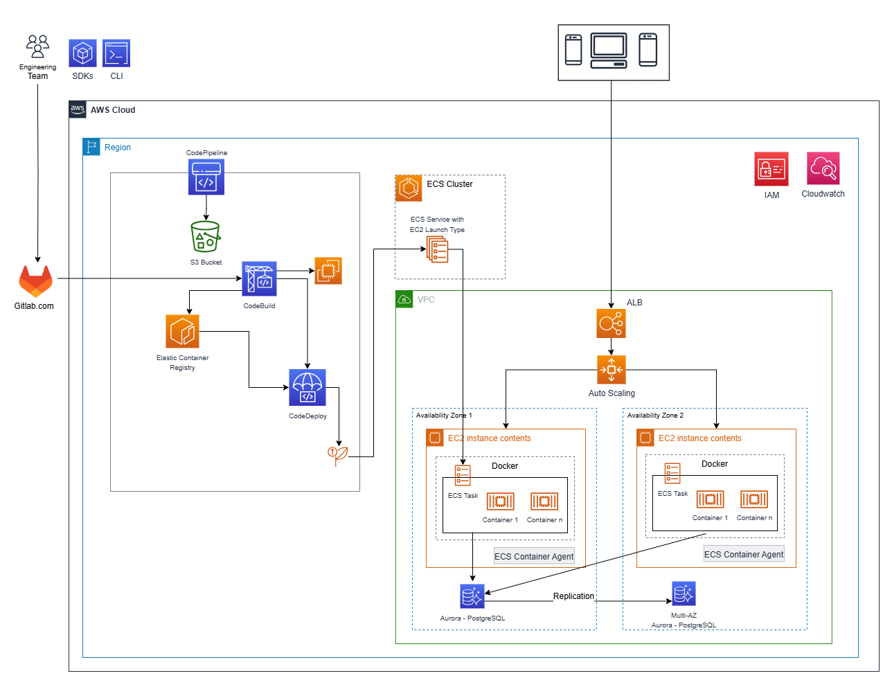

# AWS DevOps Blue/Green Pipeline Workshop (Terraform IaC)

This project is inspired by the official "[Building your first DevOps Blue/Green pipeline with Amazon ECS](https://catalog.us-east-1.prod.workshops.aws/workshops/4b59b9fb-48b6-461c-9377-907b2e33c9df/en-US)" workshop. It recreates the solution using **Terraform** for full Infrastructure as Code and **GitHub Actions** for CI/CD automation. The goal is to deliver safe, repeatable, and zero-downtime deployments on AWS.

The workshop guides participants through the process of setting up a robust and automated Blue/Green deployment pipeline for applications hosted on Amazon Elastic Container Service (ECS). By leveraging Blue/Green deployments, we ensure zero downtime, rapid rollbacks, and safer software releases. All the AWS resources required for this workshop are provisioned and managed using Terraform, demonstrating best practices for Infrastructure as Code. 

## Table of Content
<!-- - [Architectural Diagram](#architectural-diagram) -->
- [Prerequisites](#prerequisites)
- [Technologies Used](#technologies-used)
  * [Services Used](#services-used)

<!--
## Architectural Diagram

 
-->

## Prerequisites
- **OIDC(OpenID Connect) IAM Role**: Allows an external identity provider (like GitHub or an EKS cluster) to assume an IAM role in your AWS account without needing long-lived access keys. 
- **S3 Bucket**: For terraform remote state management.

## Technologies Used

| **Category** | **Tools** |
|---------|------|
| Infrastructure as Code | Terraform |
| Cloud Provider | AWS |
| Container Orchestration | Amazon ECS (EC2) |
| CI/CD | GitHub Actions |
| Container Registry | Amazon ECR |
| Load Balancing | ALB with Blue/Green strategy |

### Services Used

- **AWS IAM**: For permissions to allow your role and other AWS services to execute the infrastructure code.
- **Amazon ECS**: Service & Task Definitions.
- **Amazon EC2**: Compute engine for `Amazon ECS` with autoscaling and ALB.
- **Amazon Aurora**: Database for the application.
- **Amazon ECR**: For storing container images.
- **Amazon S3**: For Terraform state management.
- **Amazon Cloudwatch**: Collect and store logs from the app and infrastructure.
